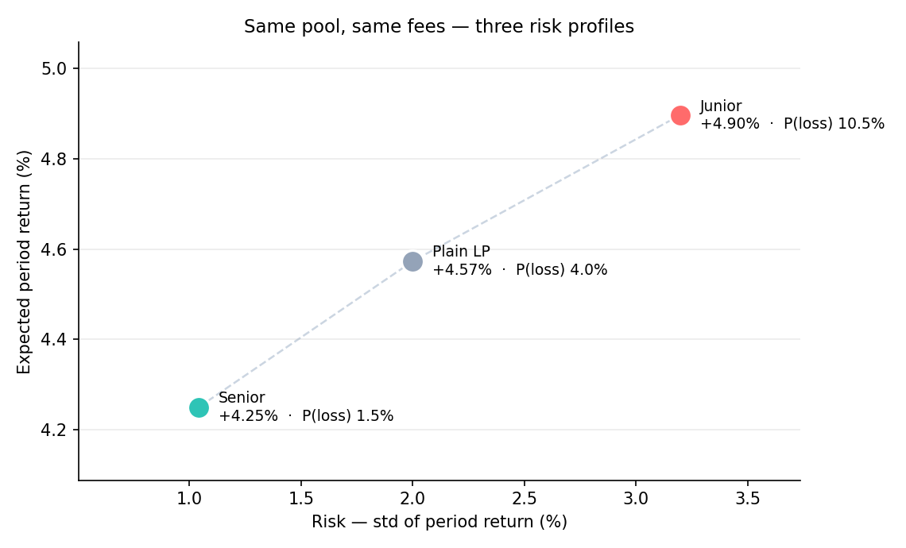
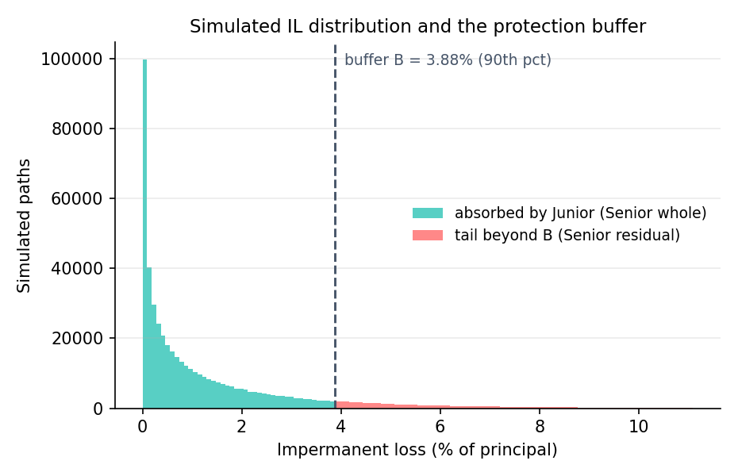

# TrancheGuard

**Tranched impermanent-loss insurance for Uniswap v4.**

> Impermanent loss is not eliminated — it becomes a *choice*.


<p align="center">
  
</p>

---

## Partner integrations

No partner integrations.

---

## TL;DR

TrancheGuard is a Uniswap v4 hook (`TrancheHook`) that splits a pool into two tranches LPs choose at deposit:

- **Senior** — protected from impermanent loss up to a buffer **`B`**; gives up part of its fee income to pay for that protection.
- **Junior** — absorbs IL first (first-loss), and earns the larger share **`α`** of pool fees in return.

The two parameters `(B, α)` are **not guessed**. They are derived from a Monte-Carlo simulation of the pair's impermanent-loss distribution and injected as immutable hook parameters at deployment. In the representative case, a Senior LP is **~2.6× less likely** to end a period underwater than a plain LP, for **~0.3%** less expected return.

The on-chain hook enforces the loss waterfall and settlement; the [off-chain actuarial engine](offchain/README.md) decides the parameters.

---

## The problem

A Uniswap v3/v4 LP already makes one choice — their **price range**. But range is a single, *coupled* dial: tighten it and you earn more fees, take more IL, and risk going out of range, all at once. And at any range, IL hits every LP in the position **pro-rata** — nobody is protected, nobody is paid to take the first loss.

So risk-averse capital's only lever is to go wide, which surrenders the fees it came for. LPing has a *where* dial. It has no *who-takes-the-loss* dial. TrancheGuard adds one.

---

## The idea: two tranches and a waterfall

Picture a position's loss as a stack that fills from the bottom up:

```
  ┌───────────────────────────┐   ▲ larger loss
  │          SENIOR           │   │  protected — only hit if loss exceeds B
  ├───────────────────────────┤ ──┼── buffer  B
  │          JUNIOR           │   │  first-loss — absorbs IL first
  └───────────────────────────┘   │  loss enters at the bottom
```

- Loss is allocated **Junior → Senior**. Junior absorbs IL first, up to the buffer `B`. Senior is touched only if the loss exceeds `B`.
- Fees are split **`α` to Junior, `1 − α` to Senior**. Junior takes the risk, so it earns the bigger share; Senior pays for protection out of its fees.
- The protection paid to Senior is drawn from **Junior's accumulated fee fund**, never from Junior's principal.

Your **range** decides *where* you provide liquidity; your **tranche** decides *who* bears the loss — two independent choices.

---

## What makes it different: parameters are derived, not guessed

The buffer and the split come out of an off-chain actuarial pipeline, not a spreadsheet guess.

```
volatility σ (from historical price data) + pool config
        │
        ▼
Monte Carlo IL distribution        500k paths · concentrated-liquidity · range-aware
        │
        ▼
derive (B, α)                      B = loss-distribution percentile
                                   α solves  R_junior = R_senior + risk premium
        │
        ▼
feasibility + risk metrics         solvent? both tranches better off?
        │
        ▼
immutable hook params              BUFFER_WAD, ALPHA_WAD, HOOK_FEE_WAD
```

<p align="center">
  
</p>

- **Buffer `B`** is a *coverage choice*: pick how often Senior should be whole (e.g. the 90th percentile), and `B` is the loss level that achieves it — so in ~9 of 10 simulated scenarios, Senior loses nothing.
- **Split `α`** is a *fairness condition*: compare each tranche's expected return and choose `α` so Junior earns a little more than Senior — a fair premium for taking first-loss risk. With no protection and no premium it reduces to a 50/50 split; protection and the premium push it above ½.

The full derivation — IL model, price model, tranche-return algebra, the risk premium, feasibility gates — lives in **[`offchain/README.md`](offchain/README.md)**.

---

## The payoff

Same pool, same fees — three risk profiles. Representative case (σ = 60%, 30-day horizon, `±6000` tick range, 500k paths):

| Tranche | Expected return | Std | Probability of a losing position |
|---|---|---|---|
| **Senior** (protected) | +4.25% | 1.04% | **1.5%** |
| Plain LP (unprotected) | +4.57% | 2.00% | 4.0% |
| **Junior** (first-loss) | +4.90% | 3.20% | **10.5%** |

<sub>Transcribed from the Representative-case output of `python tranche_params.py`. When re-deriving, update every occurrence.</sub>

Risk and return are **monotone** across the three profiles — a genuine tranche structure. A Senior LP cuts its probability of ending underwater by ~2.6× versus a plain LP, for about 0.3% less expected return. Junior is paid a premium to take the other side.

---

## On-chain architecture

The hook implements three lifecycle callbacks:

| Callback | What it does |
|---|---|
| `afterAddLiquidity` | Registers the LP's tranche and **principal**, valued from the PoolManager's `BalanceDelta` (not from caller-supplied data). |
| `afterSwap` | Captures a small additive fee into the fund and splits it `α` / `1 − α` into the Junior and Senior claims. |
| `afterRemoveLiquidity` | Runs the waterfall on exit: `absorbed = min(IL, B·V_hodl, juniorFund)`, pays Senior from the Junior fund, and settles fund → LP via a return delta. |

**Trust anchors**
- **Principal is read from the PoolManager `BalanceDelta`**, never from `hookData` — a caller cannot inflate their stake. `hookData` carries only `(lp, tranche)`.
- **Ownership is bound to the caller** (`require(lp == sender)`) — a router can't claim another LP's position or protection.
- IL is measured against a **manipulation-resistant EMA price**, and the waterfall is **capped** at both the buffer and the actual fund balance, with a fund-solvency invariant checked before settlement.

Key contracts:

| File | Role |
|---|---|
| `src/TrancheHook.sol` | The hook — tranche registration, fee fund, loss waterfall, settlement. |
| `src/ILMath.sol` | Concentrated-liquidity IL math (`ilFromSqrtPrices`), mirrored by the off-chain model. |

---

## Parameters (representative case)

| Model input | Value |
|---|---|
| Volatility σ | 60% (estimated from historical price data) |
| Horizon T | 30 days |
| Tick range | ±6000 (price ≈ `[0.5488, 1.8221]`) |
| Fee turnover | 20× |
| Buffer percentile | 90th |
| Risk price λ | 0.30 |

| Derived output | Value | Constructor arg (WAD) |
|---|---|---|
| Buffer `B` | 3.88% | `BUFFER_WAD = 38775050248575256` |
| Split `α` | 0.626 | `ALPHA_WAD  = 626226265377168256` |
| Expected IL | 1.43% | — |

<sub>Transcribed from the Representative-case output of `python tranche_params.py`. When re-deriving, update every occurrence.</sub>

> These are one configuration. To derive parameters for a different pair, volatility, range, or horizon, run the [analysis engine](offchain/README.md) and inject the resulting WAD values into the constructor.

---

## Repository layout

```
.
├── src/
│   ├── TrancheHook.sol          # the v4 hook: tranches, fund, waterfall, settlement
│   └── ILMath.sol               # concentrated-liquidity IL math
├── test/
│   ├── TrancheHook.t.sol        # unit: fee capture, settlement, protection, auth
│   ├── TrancheHook_demo.t.sol   # end-to-end demo with MC-derived params
│   ├── TrancheHook_limits.t.sol # boundary: IL > buffer, fund-insufficient
│   ├── TrancheHook_fuzz.t.sol   # fuzz: ILMath properties
│   └── TrancheTestBase.sol      # shared per-LP test harness
└── offchain/
    ├── tranche_params.py        # Monte Carlo engine: IL dist → (B, α) → metrics
    ├── requirements.txt
    └── README.md                # full parameter derivation & math
```

---

## Build & test

Requires [Foundry](https://book.getfoundry.sh/getting-started/installation).

```bash
forge install        # fetch dependencies
forge build
forge test           # full suite — 12 passing
```

Run the end-to-end demo and read the protection in action:

```bash
forge test --match-path test/TrancheHook_demo.t.sol -vv
```

It deploys a real v4 pool with the MC-derived `(B, α)`, builds the fund with swaps, then exits a Senior LP after an adverse price move and reports how much of the Senior IL the Junior fund absorbed.

Run the off-chain parameter engine:

```bash
cd offchain
pip install -r requirements.txt
python tranche_params.py
```

---

## What the tests prove

The demo test (`test_demo_derivedParams_protectSenior`) asserts three things, the heart of the mechanism:

- `absorbed > 0` — the protection actually fires on-chain.
- `residual < ilLoss` — the Senior LP bears strictly less than a plain, unprotected LP would.
- `absorbed == min(IL, B·V_hodl, juniorFund)` — the absorbed amount is exactly the waterfall formula.

The suite also covers fee capture and `α` split, fund → LP settlement, the loss waterfall, anti-spoofing auth, boundary cases (IL above buffer; fund insufficient), and fuzz tests over the IL math — 12 tests, all green.

> The demo's `HOOK_FEE_WAD` is set high so a few swaps fill the fund; production fees are small (~0.3% or lower) and the fund builds gradually. It is a single-path illustration of mechanism correctness, not a reproduction of the Monte-Carlo distribution — that is the role of the Python analysis.

---

## Status, limitations & roadmap

A **tested MVP**, with the edges stated plainly rather than hidden.

**Shipped**
- v4 hook with `afterSwap` / `afterRemoveLiquidity` return-delta settlement.
- Monte-Carlo-derived `(B, α)` injected on-chain.
- Loss waterfall with real fund settlement and a solvency invariant.
- Concentrated-liquidity IL math (3-branch, overflow-safe), mirrored on- and off-chain.
- 12 green tests: unit, fuzz, limit, and anti-spoofing auth.

**Known limitations (deliberate MVP scope)**
- Fund and IL are accounted in `currency1` only (cross-currency conversion is TODO).
- One position per LP; removal must be a full close of the registered range (enforced).
- Price reference is a count-based EMA, not a time-weighted TWAP.
- Fees are captured on one swap direction only.
- Auth is `sender == lp`; shared custodial routers need PositionManager `ownerOf` delegation.
- Equal tranches (S : J = 1) assumed; solvency is enforced in expectation, not in the tail.
- Not externally audited.

**Roadmap**
- EMA → time-weighted TWAP oracle.
- Two-sided fee capture.
- PositionManager-based (NFT) owner auth.
- Multiple positions / partial closes per LP.
- General capital structure (S : J ≠ 1) and a tail-solvency gate.
- Per-range parameterization and live σ estimation from on-chain history (a natural fit for an off-chain AVS / oracle).
- External audit (e.g. via the Uniswap Foundation Security Fund).

---

## References & acknowledgements

- Built for the **Uniswap Hook Incubator (UHI9)** — *Impermanent Loss & Yield* theme.
- On-chain IL math (`src/ILMath.sol`) mirrors the off-chain `il_concentrated` model; see [`offchain/README.md`](offchain/README.md).
- Uniswap v4 core & periphery; concentrated-liquidity token-amount math.
- Tranche / waterfall structure draws on standard structured-finance senior–subordinated design.

## License

MIT.